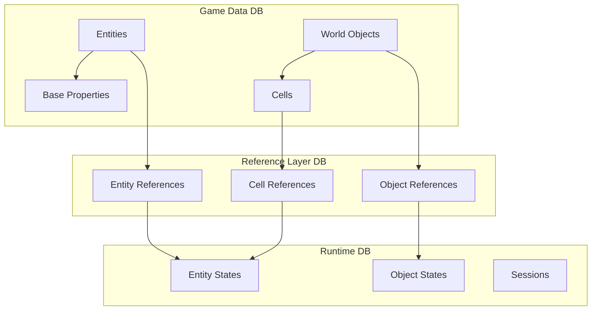
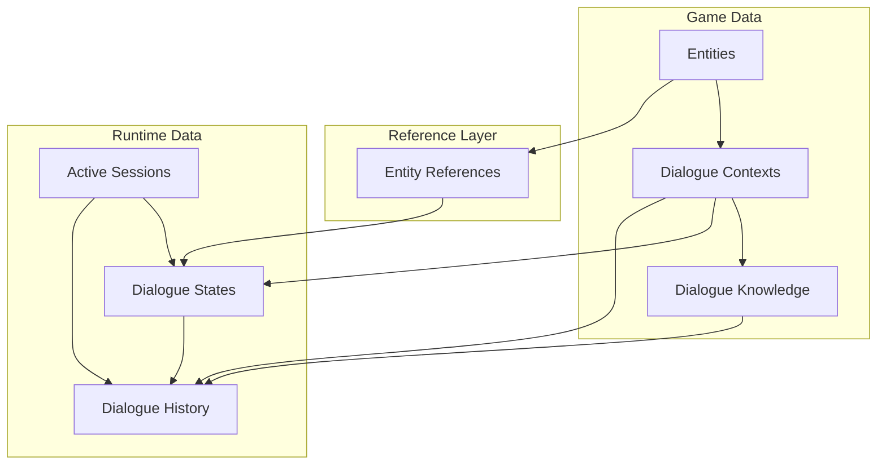
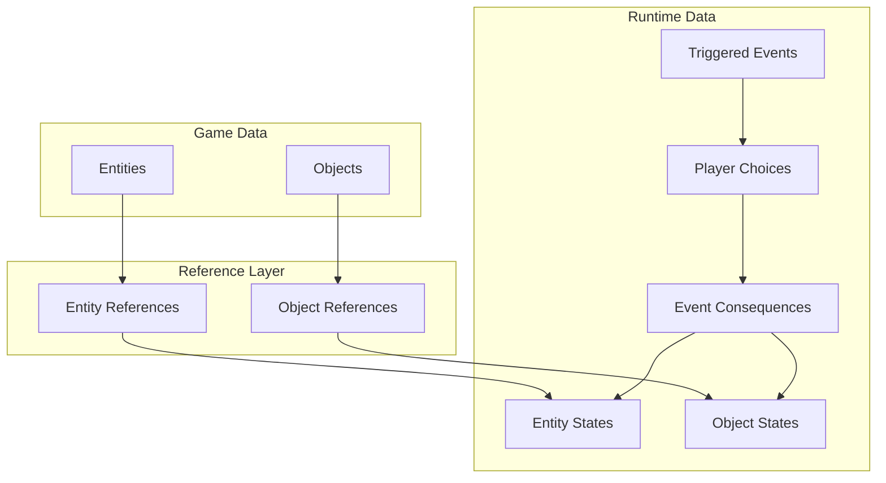

# RPG Game Database Schema

> **최신화 날짜**: 2025-12-28  
> **현재 상태**: 40개 테이블 완성, 모든 외래키 제약조건 설정 완료, SSOT 원칙 적용

## 데이터베이스 구조 개요

이 데이터베이스는 텍스트 기반 RPG 게임을 위한 스키마를 정의합니다. 데이터는 세 개의 주요 계층으로 구성됩니다:

1. Game Data (원본 데이터)
2. Reference Layer (참조 계층)
3. Runtime Data (실행 중 데이터)

## 데이터베이스 구조 다이어그램

### 기본 계층 구조



### 대화 시스템 상세 구조


### 이벤트 시스템 구조

### 디렉토리 구조

**참고**: 실제 SQL 스키마 파일들은 `database/setup/` 디렉토리에 있으며, 이 문서는 스키마 구조를 설명하는 참고 문서입니다. 초기 SQL 파일들은 `docs/archive/architecture/db_schema/`에 아카이브되어 있습니다.

```
database/setup/
├── mvp_schema.sql          # 메인 스키마 파일 (40개 테이블)
└── (기타 스키마 관련 파일들)
```

## 핵심 컴포넌트 설명

### 1. Game Data (원본 데이터)

#### World Structure
- `regions`: 최상위 지역 구분
- `locations`: 리전 내 구체적 장소
- `cells`: 실제 게임플레이가 일어나는 최소 공간 단위
  - 각 셀은 matrix_width, matrix_height로 정의된 2D 그리드 구조
  - cell_properties JSON 필드로 지형, 날씨 등 특수 속성 정의

#### Entities
- `entities`: 모든 게임 내 행동 주체의 기본 정의
- `base_properties`: 엔티티의 기본 속성 정의
- `abilities`, `equipment`, `items`, `effects`: 엔티티 관련 요소들

#### Dialogue System
- `dialogue_contexts`: 대화의 기본 정보와 조건
  - entity_id, cell_id, time_category, event_id로 대화 조건 정의
  - entity_personality: NPC의 성격과 말투
  - constraints: LLM 응답 제약사항
- `dialogue_topics`: 대화와 연관된 추가 정보
  - dialogue_id와 1:N 관계
  - 특정 조건에서 제공할 추가 정보 정의
  - JSON 조건으로 제공 시점 관리

### 2. Reference Layer

세션별 독립성과 확장성을 위한 중간 계층:

- `entity_references`: 게임 데이터의 엔티티를 실행 중인 엔티티로 매핑
- `object_references`: 게임 데이터의 오브젝트를 실행 중인 오브젝트로 매핑
- `cell_references`: 게임 데이터의 셀을 실행 중인 셀로 매핑

### 3. Runtime Data

#### States
- `entity_states`: 엔티티의 현재 상태
  - current_stats: HP, MP 등 현재 수치
  - current_position: 셀 내 좌표
  - active_effects: 적용 중인 효과들
  - inventory, equipped_items: 현재 소지/장착 상태

- `object_states`: 오브젝트의 현재 상태
  - current_state: 상호작용 가능한 오브젝트의 상태
  - current_position: 이동 가능한 오브젝트의 위치

#### Dialogue Runtime
- `dialogue_history`: 대화 기록
  - speaker_type으로 발화자 구분 (player/npc/system)
  - relevant_knowledge로 사용된 지식 추적
- `dialogue_states`: 현재 진행 중인 대화 상태
  - conversation_state: 현재 주제, 감정 상태 등
  - active_topics: 현재 활성화된 대화 주제들

#### Event System
- `triggered_events`: 발생한 모든 이벤트 기록
- `player_choices`: 플레이어의 선택 기록
- `event_consequences`: 선택에 따른 결과 기록

## 주요 기능 구현

### 1. 셀 관리 (CellManager)
```python
def get_cell_contents(runtime_cell_id):
    # 셀 내 모든 엔티티와 오브젝트 조회
    
def move_entity(runtime_entity_id, target_cell_id, new_position):
    # 엔티티 이동 처리 및 이벤트 기록
    
def can_start_dialogue(player_id, npc_id):
    # 대화 가능 여부 확인 (거리 등)
```

### 2. 대화 시스템 (LLMDialogueManager)
```python
def get_available_dialogue(entity_id, cell_id, time_category, event_id):
    # 현재 상황에 맞는 대화 컨텍스트 검색
    # 우선순위가 가장 높은 대화 선택
    
def get_dialogue_topics(dialogue_id, conditions):
    # 현재 상황에 맞는 추가 정보 검색
    # 조건에 맞는 topic 정보 반환
```

### 3. 세션 관리 (GameSession)
```python
def initialize_session():
    # 새 게임 세션 시작
    
def enter_cell(runtime_cell_id):
    # 셀 진입 처리
    # 컨텐츠 로드
    
def move_player(player_id, target_cell_id, new_position):
    # 플레이어 이동
    # 새 셀 정보 반환
```

## 확장성 고려사항

1. **세션 독립성**
   - Reference Layer를 통한 세션별 독립적인 상태 관리
   - 각 세션의 데이터 격리로 동시성 문제 해결

2. **LLM 통합**
   - 대화 시스템의 모듈화된 구조
   - 컨텍스트와 지식 베이스의 명확한 분리
   - 응답 제약사항을 통한 일관성 유지

3. **이벤트 시스템**
   - 모든 상태 변화는 이벤트로 기록
   - 이벤트-결과 체인으로 게임 진행 추적 가능
   - 플레이어 선택의 결과 명확히 기록

4. **데이터 확장**
   - JSON 필드를 통한 유연한 속성 관리
   - 각 엔티티/오브젝트 타입별 특수 속성 정의 가능
   - 새로운 컨텐츠 타입 추가 용이 

## 주요 처리 시나리오
