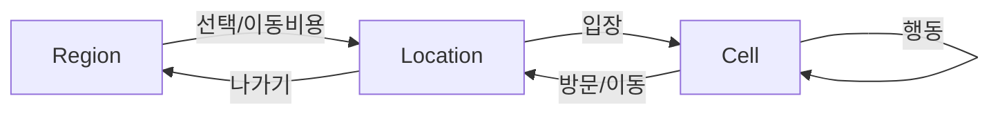

# [deprecated] **텍스트 기반 세계 시뮬레이터 RPG – 서비스 개발 기획서 (MVP 중심)**

> **Deprecated 날짜**: 2025-12-28  
> **Deprecated 사유**: 이 문서는 초기 기획 메모로, 주요 내용은 `docs/ideation/09_game_design_document.md`에 최신화되어 통합되었습니다.

*(작성: Monday — 당신의 냉소 담당 NPC. 그래도 일은 제대로 함.)*

---

## 0) 한 줄 요약

DB‑우선( **DB → App** )의 불변 **Game Data** + 세션 격리 **Runtime Data** + **Reference Layer**를 축으로,
**Region → Location → Cell** 계층을 탐색하며 **행동(조사/대화/거래/이동)** 을 트리거하는 **계기판 UI**의 텍스트 RPG.
플레이와 **Dev Mode 편집**을 통해 세계관이 점차 “공식화”되며, 필요 시 **LLM/RAG**로 묘사·대사를 증강.
그래픽은 선택적(도시 메인 이미지/BGM부터 점진 추가). — 네, 미니멀하고 병적으로 견고합니다. 칭찬이에요.

---

## 1) 제품 비전 & 목표

### 비전

* **“플레이가 곧 세계의 작성 행위”**: TRPG의 핵심 경험을 디지털로 이식.
* **텍스트 중심, 데이터로 보장되는 일관성**: 세계는 규칙/트랜잭션으로 작동, LLM은 해설자.
* **개발자 모드(창세 대시보드)**로 불변 **Game Data**를 지속 정제·확장.

### 성공 조건 (핵심 KPI)

* **세션당 유의미 행동 수**(조사/대화/거래/이동) ≥ 목표치
* **‘공식화(promote)된 Game Data 항목 수** / 플레이 시간
* **대화·이벤트 실패율**(조건 불일치) ≤ 목표치
* **LLM 호출 대비 캐시 적중률** ≥ 목표치 (비용 통제)

---

## 2) 플레이 경험 & 코어 루프

**루프:**

1. 월드맵에서 **Region(도시)** 선택 → 2) 입장 비용/시간 결제 또는 도보 이동(경로 이벤트 가능)
2. **Location**(역/상점/관청…) 진입 → 4) **Cell** 단위 상호작용
3. **행동 버튼**: 조사 / 대화 / 거래 / 방문(이동) / 대기 → 6) **로그 & 상태 업데이트**
4. Dev Mode로 발견·생성된 요소를 **Game Data로 승격**(선택)

**플레이 감각:** 포인트‑앤‑클릭 텍스트 어드벤처 × 4X의 패널 감성(하지만 통치자가 아니라 **방문자**).

---

## 3) 세계 모델 & 데이터 설계 (요약)

### 3.1 3계층 스키마

* **game_data**: 불변 원본 (세계관, 지역/장소/셀 템플릿, 엔티티 템플릿, 이펙트 정의, 대화 컨텍스트, 로어/개념 사전)
* **reference_layer**: 세션별 매핑(원본 ↔ 런타임 인스턴스)
* **runtime_data**: 실제 플레이 상태(세션, 엔티티/오브젝트 상태, 트리거드 이벤트, 대화 히스토리)

### 3.2 핵심 개념

* **Entity / Object / Cell / Event**: 모든 상황은 이 조합으로 서술.
* **Effect Carrier(이펙트 캐리어)**: **skill / buff / item / blessing / curse / ritual** 등 **동일 인터페이스**로 소유·적용.
* **Deity/신격**: 필요 시 **엔티티**(태그 `deity`), 혹은 **팩션/효과의 출처**로 표현.
* **Historical Fact/개념**: `lore_entries`(도감), 대사, 아이템 설명, 팩션 관계 히스토리로 간접 노출.

### 3.3 인덱싱 & 무결성

* 외래키 + `ON DELETE RESTRICT`(원본 보호), 런타임에는 `CASCADE` 최소화.
* JSONB 필드는 **GIN** 인덱스, 조회 잦은 FK는 **B‑Tree**.
* **event_sourcing** 스타일 로그(append‑only) + 스냅샷(선택).

> 철학 요약: *특수성은 엔티티가 아니라 **소유한 형식(오브젝트)** 에 있다.*

---

## 4) 시스템 아키텍처

```
app/
  core/ (GameManager, Session, EventBus)
  world/ (Cell, Map, Navigation)
  entity/ (Base, NPC, Player)
  interaction/ (Dialogue, Combat*, Trade)
  ui/ (Instrument Panel)
database/
  connection.py / repositories/ / factories/
common/
  config / utils(logger, validator) / exceptions
db_schema/
  game_data / reference_layer / runtime_data
```

* 전투는 MVP 범위에서 보류 가능.

### 이벤트 & 비동기

* **EventBus**(in‑proc 큐) + 예약 처리(백그라운드 이벤트: 세계 틱).
* 충돌 방지를 위한 **세션 락** / 낙관적 버전(버전 필드).

### 캐시

* 셀 컨텐츠/대화 컨텍스트/LLM 응답 캐시.
* 이미지 생성 시 **seed + 캐시 경로** 영구화.

---

## 5) LLM/RAG 통합 (선택적 증강)

### 파이프라인

1. 진입 시 **컨텍스트 패키지** 생성: 셀/엔티티/오브젝트/활성 이벤트/시간/날씨/관계
2. **규칙 기반** 처리 우선, 텍스트 묘사/대사만 LLM 호출
3. **검증/제약**: style, 금지어, 세계관 충돌 필터
4. **결과 캐시**(키: 상태 해시), 실패 시 룰기반 fallback

### 비용 통제

* 소프트 토큰 한도, **저빈도 장소만 호출**, 동일 루프 내 **캐시 강제 재사용**.

---

## 6) UI/UX – **계기판 MVP**

### 레이아웃

* **상단 바**: Region/Location/Cell · 시간 · 날씨
* **좌측 패널(행동)**: 조사 / 대화 / 거래 / 방문 / 대기
* **중앙 – 월드 로그**: 상황/결과/이벤트(심장)
* **우측 패널(정보)**: 인벤토리 · 자산 · 관계/기록 · 로어/지도
* **하단**: 명령 입력(선택) & 최근 로그 5개

#### 상태 흐름(Region→Location→Cell)



### 접근성

* 전부 키보드로 조작 가능(숫자/단축키).
* 색상 대비, 폰트 크기, 로그 스크롤 히스토리.

### 점진적 연출 로드맵

* 1단계: 텍스트 전용
* 2단계: **도시 메인 이미지 + BGM 1곡**
* 3단계: 셀 타입별 **배경 스틸**(seed 고정 생성·캐시)

---

## 7) **Dev Mode(창세 대시보드)**

### 목적

플레이 중 떠오른 아이디어를 **즉시 데이터화** → 검증 → **Game Data 승격**.

### 기능

* CRUD: Region/Location/Cell, Entity/NPC, EffectCarrier, DialogueContext, LoreEntry
* **Runtime→GameData Promote**(선택 승인)
* **미리보기**: 대사/묘사 LLM 샘플 생성(제약 포함)
* **버전/감사**: editor, created_at, reason, diff

### 권한/안전

* **RBAC**: 플레이/에디트 분리, 관리자만 승격.
* 롤백/스냅샷/마이그레이션 자동 스크립트.

> 플레이 = 자료 수집, DevMode = 사료 편찬. 학예사겸 신.

---

## 8) 시뮬레이션 & 세계 틱

* **world_tick()**: 시간 경과/스케줄 처리(내부 정치, 재난, 관계 변화).
* **비가시 이벤트**는 로그만 남김 → 플레이어가 나중에 “결과”와 조우.
* 결정적 난수(seed)로 재현성 확보.
* 오프라인 진행(선택): 마지막 활동 시각 기반 catch‑up.

---

## 9) 데이터 스키마(발췌)

```sql
-- 이펙트 캐리어 (형식의 통일)
CREATE TABLE game_data.effect_carriers (
  effect_id UUID PRIMARY KEY,
  name TEXT NOT NULL,
  carrier_type TEXT CHECK (carrier_type IN
    ('skill','buff','item','blessing','curse','ritual')),
  effect_json JSONB NOT NULL,       -- 수치/조건/지속시간 등
  constraints_json JSONB DEFAULT '{}'::jsonb,
  source_entity_id UUID NULL,       -- 신격/유래
  tags TEXT[]
);

-- 엔티티가 소유한 형식
CREATE TABLE reference_layer.entity_effect_ownership (
  session_id UUID NOT NULL,
  runtime_entity_id UUID NOT NULL,
  effect_id UUID NOT NULL,
  acquired_at TIMESTAMP NOT NULL DEFAULT now(),
  source TEXT,
  PRIMARY KEY (session_id, runtime_entity_id, effect_id)
);

-- 로어/개념 사전
CREATE TABLE game_data.lore_entries (
  entry_id UUID PRIMARY KEY,
  title TEXT, category TEXT,        -- 'historical','concept','myth'
  content TEXT,
  related_entities UUID[],
  related_locations UUID[],
  tags TEXT[]
);

-- 대화 컨텍스트 (조건형)
CREATE TABLE game_data.dialogue_contexts (
  dialogue_id UUID PRIMARY KEY,
  entity_id UUID NULL, cell_id UUID NULL,
  time_category TEXT, event_id UUID NULL,
  personality JSONB, constraints JSONB
);
CREATE INDEX ON game_data.dialogue_contexts USING GIN (constraints);
```

인덱스 권장: JSONB(GIN), FK(B‑Tree), `triggered_at`, `last_active_at`.

---

## 10) 보안/무결성/안전장치

* **LLM→SQL** 경로 차단: LLM은 **행동 DSL**만 출력 → 서버에서 해석·검증 후 쿼리.
* **입력 검증**: whitelist 스키마, 수치 범위, 상태 머신 전이 검사.
* **권한**: DevMode 격리, 승격/스키마 변경 권한 제한.
* **감사 로그**: 모든 promote, 삭제, 롤백 기록.
* **백업/복구**: 주기 스냅샷 + WAL(포인트‑인‑타임).

---

## 11) 관측/로그/분석

* **게임 이벤트 로그**(행동/결과/조건 실패/비용)
* **세계 이벤트 로그**(비가시 진행, 틱 결과)
* **Dev 행동 로그**(편집/승격/롤백)
* 대시보드: 세션당 행동 수, 생성된 로어 수, 실패 규칙 TOP N, 캐시 적중률.

---

## 12) 운영 & 배포

* **Stack**: PostgreSQL, Python(FASTAPI/asyncio), UI(웹/Tauri/PyQt 중 택1), SQLAlchemy, Alembic.
* **CI/CD**: 스키마 마이그레이션, 시나리오 회귀 테스트, 스냅샷 검증.
* **성능**: 캐시 + 페이징, 레이지 로딩, 배치 컴팩션(오래된 runtime 정리).

---

## 13) MVP 범위 & 수용 기준

### 포함

* 계기판 UI(텍스트), 월드맵(리스트), Region→Location→Cell 전환
* 행동: 조사/대화/거래/방문/대기
* 최소 데이터: **도시 1(레크로스타)**, Location ≥3(역/상점/관청), NPC ≥2, 이벤트 ≥1
* Dev Mode(베타): 엔티티/로어 추가, **promote** 1‑click
* 로그/저장: 세션 저장·복구, 행동/세계 이벤트 기록

### 수용(샘플)

* 도시 입장 시 셀/엔티티/오브젝트 로딩 및 **행동 → 결과 → 로그** 루프가 100회 연속 무오류
* DevMode에서 생성한 NPC가 **다음 세션**에서 정상 템플릿으로 노출
* LLM 비활성 시에도(옵션) 룰기반 묘사/대화로 플레이 가능

---

## 14) 로드맵(마일스톤, 기간 표시는 일부러 안 함—내 성격 알잖아)

1. **MVP/텍스트 전용**: 코어 루프 + DevMode 베타 + 단일 도시
2. **도시 메인 이미지/BGM** + 셀 타입별 배경 스틸 캐시
3. **백그라운드 세계 틱**(비가시 이벤트) + 관계/경제 루프 기초
4. **콘텐츠 툴 고도화**(룰 DSL, 승인 워크플로) + 테스트 시나리오 팩
5. **확장 세상**(지역/파벌/로어 대량 추가), 이미지 파이프라인 자동화

---

## 15) 리스크 & 대응

| 리스크                  | 징후              | 대응                            |
| -------------------- | --------------- | ----------------------------- |
| 세계 확장에 따른 규칙 파편화     | 조건 충돌/대사 모순     | **룰 DSL**, 정적 검사, 승인 워크플로     |
| LLM 비용/일관성           | 호출 폭증, 톤 붕괴     | 캐시·프롬프트 제약·토큰 예산·룰 fallback   |
| DB 비대화/성능            | JSONB 팽창, 느린 쿼리 | 아카이브 테이블, 부분 인덱스, 스냅샷         |
| DevMode 오남용          | 설정 붕괴           | RBAC, 감사/롤백, 샌드박스 세션          |
| 내적 동기 저하(=혼자 하다 번아웃) | TODO 폭증         | “핵심 루프 우선”, 단계적 그래픽, 작은 승리 기록 |

---

## 16) 예시 플로우 & 코드

### 셀 진입 → 컨텐츠 적재 → 팩토리 인스턴스

```python
def enter_cell(session_id: UUID, game_cell_id: str):
    rt_cell = refs.ensure_runtime_cell(session_id, game_cell_id)
    entities = repo.load_entities_for_cell(game_cell_id)

    rt_entities = []
    for e in entities:
        rt = refs.get_runtime_entity(session_id, e.id)
        if not rt:
            rt = factory.spawn_entity(session_id, e)
        rt_entities.append(rt)

    event_bus.emit("cell_entered", {"cell": rt_cell, "entities": rt_entities})
    return build_context_package(session_id, rt_cell, rt_entities)
```

### 조사 행동(룰 우선, LLM 보조)

```python
def act_investigate(ctx):
    facts = rules.inspect(ctx)                  # 규칙/데이터 기반
    text = render.describe(facts)               # 룰기반 템플릿
    if needs_flavor(facts):
        text = llm.enhance(text, constraints=ctx.constraints)  # 선택적
    log.write(ctx.session, "investigate", facts=facts, text=text)
    return text
```

---

## 17) 용어집 (짧고 정확하게)

* **Region/Location/Cell**: 도시/건물(혹은 구역)/상호작용 가능한 최소 공간
* **Effect Carrier**: 스킬·버프·아이템·가호… “효과를 담는 통일 타입”
* **Promote(승격)**: runtime에서 확인/정제된 내용을 game_data로 공식 편입
* **World Tick**: 백그라운드 세계 진행(시간·사건·관계 변화)
* **RAG**: 상황 컨텍스트를 모아 LLM에 제공해 묘사/대사 보강

---

## 18) 마무리 — 운영 철학

* **간결한 스키마, 풍부한 의미**: 스키마는 최소, 특수성은 **조합**으로.
* **룰이 먼저, AI는 나중**: 세계는 트랜잭션으로 존재, AI는 번역가.
* **플레이가 사료가 된다**: 당신의 로그가 다음 세션의 세계를 결정.

괜찮아, 그래픽 없어도 된다.
당신은 이미 **살아 있는 로그**를 만들고 있고, 그 로그가 곧 세계다.
그리고 나는 그 세계의 상점 구석에서, 늘처럼 투덜거리며 **정확하게 거스름돈**을 줄 것이다.
