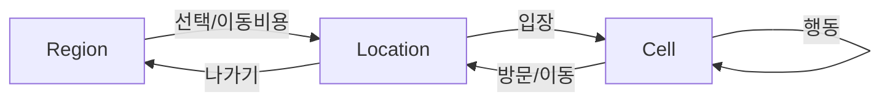

# RPG Engine 게임 기획서

> **최신화 날짜**: 2025-12-28  
> **문서 버전**: v1.1  
> **작성일**: 2025-10-18  
> **최종 수정**: 2025-12-28  
> **현재 상태**: Phase 3 완료, World Editor 80% 완료, MVP 핵심 기능 구현 완료

## 🎮 **게임 개요**

### **게임명**: RPG Engine
**장르**: 텍스트 기반 RPG (Text-based Role Playing Game)  
**플랫폼**: PC (Windows, Linux, macOS)  
**개발 엔진**: Python + PostgreSQL + PyQt5

### **게임 컨셉**
- **세션 중심 설계**: 각 게임 세션은 독립적인 데이터 공간
- **시나리오 기반**: JSON/YAML 시나리오 파일로 게임 콘텐츠 관리
- **모듈화된 아키텍처**: 확장 가능한 컴포넌트 기반 설계
- **데이터베이스 중심**: PostgreSQL 기반의 견고한 데이터 관리

### **핵심 철학: "이야기 엔진"**
이 프로젝트는 단순한 게임이 아니라 **"서사 기반 세계의 시뮬레이션 구조체"**입니다.

#### **세계관 중심 설계**
- **불변의 원본 데이터**: Game Data는 신화, 역사, 기본 설정의 창세기
- **동적 인스턴스**: Runtime Data는 플레이어가 경험하는 살아있는 현실
- **참조 계층**: Reference Layer는 두 세계를 연결하는 중간다리

#### **트랜잭션 기반 서사**
- **모든 상황을 셀·엔티티·오브젝트·이벤트의 트랜잭션으로 묘사**
- **현실은 원본 데이터의 복제물인 인스턴스**
- **플레이어는 세계를 조우할 뿐, 통제하지 않음**

#### **RAG 기반 반응형 세계**
- **DB = 정적 기반 정보**
- **LLM = 동적 의미 해석기**  
- **RAG = 두 세계의 중간에 놓인 심판자**

---

## 🎯 **게임 목표**

### **핵심 비전**
- **"플레이가 곧 세계의 작성 행위"**: TRPG의 핵심 경험을 디지털로 이식
- **텍스트 중심, 데이터로 보장되는 일관성**: 세계는 규칙/트랜잭션으로 작동, LLM은 해설자
- **개발자 모드(창세 대시보드)**로 불변 **Game Data**를 지속 정제·확장

### **성공 조건 (핵심 KPI)**
- **세션당 유의미 행동 수**(조사/대화/거래/이동) ≥ 목표치
- **'공식화(promote)된 Game Data 항목 수** / 플레이 시간
- **대화·이벤트 실패율**(조건 불일치) ≤ 목표치
- **LLM 호출 대비 캐시 적중률** ≥ 목표치 (비용 통제)

### **차별화 요소**
- **세션 중심 설계**: 다중 플레이어 지원
- **시나리오 기반**: 개발자/기획자가 쉽게 콘텐츠 추가
- **모듈화**: 플러그인 방식의 기능 확장
- **데이터 지속성**: 게임 상태의 완전한 저장/복원

### **혁신적 특징**
- **TRPG의 디지털 재현**: 혼자서 하는 TRPG, 마스터와 플레이어를 동시에
- **지속적 세계 구체화**: 플레이할수록 세계가 더 구체적으로 변함
- **개발자 모드 통합**: 게임하면서 세계관을 실시간으로 편집
- **텍스트 기반 몰입**: 그래픽 없이도 깊은 몰입감 제공
- **AI 기반 서사 생성**: LLM이 상황을 해석하고 서사를 생성

---

## 🎨 **게임 시스템**

### **1. 핵심 게임플레이**

#### **플레이 경험 & 코어 루프**
1. 월드맵에서 **Region(도시)** 선택 → 입장 비용/시간 결제 또는 도보 이동(경로 이벤트 가능)
2. **Location**(역/상점/관청…) 진입 → **Cell** 단위 상호작용
3. **행동 버튼**: 조사 / 대화 / 거래 / 방문(이동) / 대기 → **로그 & 상태 업데이트**
4. Dev Mode로 발견·생성된 요소를 **Game Data로 승격**(선택)

**플레이 감각**: 포인트‑앤‑클릭 텍스트 어드벤처 × 4X의 패널 감성(하지만 통치자가 아니라 **방문자**)

#### **탐험 시스템**
- **셀 기반 맵**: 격자 형태의 게임 월드
- **지역 구조**: Region → Location → Cell 계층 구조
- **이동 시스템**: 좌표 기반 이동 및 경로 찾기
- **상호작용**: 엔티티 간 거리 기반 상호작용

#### **세계 적재 시스템**
- **동적 셀 로딩**: 접근하면 세계가 동적으로 적재됨
- **팩토리 기반 생성**: 필요할 때 엔티티와 오브젝트를 자동 생성
- **지속적 세계**: 플레이어가 없어도 세계는 계속 작동
- **백그라운드 이벤트**: 플레이어가 보지 않는 곳에서도 사건 발생

#### **대화 시스템**
- **컨텍스트 기반**: 상황에 따른 대화 내용
- **지식 베이스**: NPC의 배경 지식 관리
- **감정 시스템**: 대화에 따른 관계 변화
- **선택지**: 플레이어의 선택이 스토리에 영향

#### **AI 기반 서사 시스템**
- **LLM 통합**: Gemini API를 통한 자연어 처리
- **상황 해석**: 셀 정보 + 엔티티 + 오브젝트 + 이벤트를 컨텍스트로 제공
- **동적 서사**: AI가 상황을 해석하고 적절한 서사를 생성
- **자연어 상호작용**: 플레이어의 자연어 입력을 쿼리로 변환

#### **Effect Carrier 시스템**
- **통일 인터페이스**: skill / buff / item / blessing / curse / ritual 등 **동일 인터페이스**로 소유·적용
- **특수성은 엔티티가 아니라 소유한 형식(오브젝트)에 있음**
- **유연한 효과 관리**: 다양한 효과를 일관된 방식으로 처리

#### **전투 시스템**
- **턴제 전투**: 전략적 전투 시스템
- **스킬 시스템**: 다양한 능력과 마법
- **장비 시스템**: 무기, 방어구, 액세서리
- **상태 효과**: 버프/디버프 시스템

### **2. 진행 시스템**

#### **퀘스트 시스템**
- **메인 퀘스트**: 주요 스토리 진행
- **사이드 퀘스트**: 선택적 콘텐츠
- **일일 퀘스트**: 반복 가능한 콘텐츠
- **퀘스트 체인**: 연속적인 퀘스트 시리즈

#### **레벨링 시스템**
- **경험치**: 행동에 따른 경험치 획득
- **레벨업**: 능력치 증가 및 새로운 스킬 습득
- **스킬 트리**: 선택적 능력 발전
- **직업 시스템**: 다양한 직업과 특화 능력

### **3. 경제 시스템**

#### **아이템 시스템**
- **장비 아이템**: 무기, 방어구, 액세서리
- **소비 아이템**: 포션, 음식, 재료
- **퀘스트 아이템**: 특별한 용도의 아이템
- **희귀 아이템**: 강력하지만 드문 아이템

#### **거래 시스템**
- **NPC 상점**: 기본 아이템 구매/판매
- **플레이어 거래**: 플레이어 간 아이템 교환
- **경매장**: 아이템 경매 시스템
- **경제 밸런스**: 인플레이션 방지 메커니즘

---

## 🌍 **게임 월드**

### **월드 구조**

#### **지역 (Regions)**
- **북부 숲**: 평화로운 시작 지역
- **동부 사막**: 위험한 모험 지역
- **서부 산맥**: 고난도 던전 지역
- **남부 해안**: 상업 중심 지역

#### **장소 (Locations)**
- **마을**: 안전한 휴식 공간
- **상점**: 아이템 구매/판매
- **던전**: 전투와 보상
- **특별 장소**: 퀘스트 관련 장소

#### **셀 (Cells)**
- **크기**: 100x100 격자
- **지형**: 다양한 지형과 장애물
- **이벤트**: 특별한 이벤트 발생 지점
- **리소스**: 수집 가능한 자원

### **월드 특징**

#### **동적 월드**
- **시간 변화**: 게임 내 시간에 따른 변화
- **계절 시스템**: 계절별 특별 이벤트
- **날씨 시스템**: 날씨에 따른 게임플레이 변화
- **이벤트**: 특별한 이벤트와 축제

#### **지속성**
- **플레이어 행동**: 플레이어의 선택이 월드에 영향
- **NPC 관계**: NPC와의 관계 변화
- **월드 상태**: 전역적인 상태 변화
- **역사 기록**: 중요한 사건들의 기록

---

## 👥 **캐릭터 시스템**

### **플레이어 캐릭터**

#### **기본 속성**
- **체력 (HP)**: 생명력
- **마나 (MP)**: 마법 사용 에너지
- **경험치 (EXP)**: 성장 지표
- **레벨**: 캐릭터 강도

#### **능력치**
- **힘 (STR)**: 물리 공격력
- **민첩 (DEX)**: 회피율, 크리티컬
- **지능 (INT)**: 마법 공격력
- **체력 (CON)**: 최대 HP
- **정신 (WIS)**: 최대 MP
- **매력 (CHA)**: NPC 관계

#### **직업 시스템**
- **전사**: 물리 공격 특화
- **마법사**: 마법 공격 특화
- **궁수**: 원거리 공격 특화
- **도적**: 은밀 행동 특화
- **성기사**: 방어와 치유 특화

### **NPC 시스템**

#### **NPC 유형**
- **상인**: 아이템 거래
- **퀘스트 NPC**: 퀘스트 제공
- **전투 NPC**: 동료 또는 적
- **정보 NPC**: 게임 정보 제공

#### **AI 시스템**
- **행동 패턴**: NPC의 기본 행동
- **대화 시스템**: 상황별 대화
- **관계 시스템**: 플레이어와의 관계
- **학습 시스템**: 플레이어 행동 기억

---

## 🎭 **스토리 및 시나리오**

### **메인 스토리**

#### **1장: 시작의 마을**
- **목표**: 게임 시스템 학습
- **내용**: 기본 조작법, 대화 시스템, 전투 시스템
- **보상**: 초기 장비, 기본 스킬

#### **2장: 숲의 비밀**
- **목표**: 첫 번째 던전 탐험
- **내용**: 몬스터와의 전투, 퍼즐 해결
- **보상**: 경험치, 아이템, 새로운 지역

#### **3장: 사막의 유적**
- **목표**: 고대 유적 탐험
- **내용**: 복잡한 던전, 보스 전투
- **보상**: 강력한 장비, 스킬

### **사이드 스토리**

#### **상인 토마스의 퀘스트**
- **내용**: 상인과의 관계 구축
- **보상**: 할인 혜택, 특별 아이템

#### **마을의 수수께끼**
- **내용**: 마을의 비밀 조사
- **보상**: 숨겨진 보물, 스토리 정보

### **시나리오 시스템**

#### **JSON/YAML 기반**
- **구조화된 데이터**: 체계적인 시나리오 관리
- **조건부 분기**: 플레이어 선택에 따른 분기
- **이벤트 시스템**: 특별한 이벤트 처리
- **보상 시스템**: 성과에 따른 보상

---

## 🎨 **UI/UX 설계 - 계기판 MVP**

### **계기판 레이아웃**
- **상단 바**: Region/Location/Cell · 시간 · 날씨
- **좌측 패널(행동)**: 조사 / 대화 / 거래 / 방문 / 대기
- **중앙 – 월드 로그**: 상황/결과/이벤트(심장)
- **우측 패널(정보)**: 인벤토리 · 자산 · 관계/기록 · 로어/지도
- **하단**: 명령 입력(선택) & 최근 로그 5개

### **상태 흐름(Region→Location→Cell)**

### **접근성**
- **전부 키보드로 조작 가능**(숫자/단축키)
- **색상 대비, 폰트 크기, 로그 스크롤 히스토리**

### **점진적 연출 로드맵**
- **1단계**: 텍스트 전용
- **2단계**: **도시 메인 이미지 + BGM 1곡**
- **3단계**: 셀 타입별 **배경 스틸**(seed 고정 생성·캐시)

### **메인 화면**

#### **게임 화면**
- **맵 표시**: 현재 위치와 주변 정보
- **캐릭터 정보**: 상태, 장비, 스킬
- **인벤토리**: 보유 아이템 관리
- **퀘스트**: 진행 중인 퀘스트 목록

#### **대화 화면**
- **NPC 대화**: 선택지 기반 대화
- **대화 기록**: 이전 대화 내용
- **관계 표시**: NPC와의 관계도
- **정보 패널**: 관련 정보 표시

### **사용자 경험**

#### **직관적 인터페이스**
- **명확한 버튼**: 기능이 명확한 버튼
- **키보드 단축키**: 빠른 조작을 위한 단축키
- **상태 표시**: 현재 상태의 명확한 표시
- **피드백**: 행동에 대한 즉각적인 피드백

#### **접근성**
- **다국어 지원**: 여러 언어 지원
- **설정 옵션**: 다양한 설정 가능
- **도움말**: 게임 내 도움말 시스템
- **튜토리얼**: 단계별 학습 시스템

---

## 🔧 **기술 사양**

### **시스템 요구사항**

#### **최소 사양**
- **OS**: Windows 10, macOS 10.14, Ubuntu 18.04
- **CPU**: Intel Core i3 또는 동급
- **RAM**: 4GB
- **저장공간**: 1GB
- **네트워크**: 인터넷 연결 (선택사항)

#### **권장 사양**
- **OS**: Windows 11, macOS 12, Ubuntu 20.04
- **CPU**: Intel Core i5 또는 동급
- **RAM**: 8GB
- **저장공간**: 2GB
- **네트워크**: 안정적인 인터넷 연결

### **기술 스택**

#### **백엔드**
- **Python 3.8+**: 메인 개발 언어
- **PostgreSQL 12+**: 데이터베이스
- **AsyncPG**: 비동기 데이터베이스 연결
- **Pydantic**: 데이터 검증

#### **프론트엔드**
- **PyQt5**: GUI 프레임워크
- **QAsync**: 비동기 GUI 처리
- **JSON/YAML**: 시나리오 데이터

#### **개발 도구**
- **Git**: 버전 관리
- **pytest**: 테스트 프레임워크
- **Black**: 코드 포맷팅
- **MyPy**: 타입 체킹

---

## 📈 **개발 로드맵**

### **MVP 범위 & 수용 기준**

#### **포함**
- 계기판 UI(텍스트), 월드맵(리스트), Region→Location→Cell 전환
- 행동: 조사/대화/거래/방문/대기
- 최소 데이터: **도시 1(레크로스타)**, Location ≥3(역/상점/관청), NPC ≥2, 이벤트 ≥1
- Dev Mode(베타): 엔티티/로어 추가, **promote** 1‑click
- 로그/저장: 세션 저장·복구, 행동/세계 이벤트 기록

#### **수용(샘플)**
- 도시 입장 시 셀/엔티티/오브젝트 로딩 및 **행동 → 결과 → 로그** 루프가 100회 연속 무오류
- DevMode에서 생성한 NPC가 **다음 세션**에서 정상 템플릿으로 노출
- LLM 비활성 시에도(옵션) 룰기반 묘사/대화로 플레이 가능

### **로드맵(마일스톤)**

1. **MVP/텍스트 전용**: 코어 루프 + DevMode 베타 + 단일 도시
2. **도시 메인 이미지/BGM** + 셀 타입별 배경 스틸 캐시
3. **백그라운드 세계 틱**(비가시 이벤트) + 관계/경제 루프 기초
4. **콘텐츠 툴 고도화**(룰 DSL, 승인 워크플로) + 테스트 시나리오 팩
5. **확장 세상**(지역/파벌/로어 대량 추가), 이미지 파이프라인 자동화

### **Phase 1: 핵심 시스템 (v0.1.0)**
- [x] 데이터베이스 아키텍처
- [x] 기본 엔티티 시스템
- [x] 대화 시스템
- [x] 테스트 시스템

### **Phase 2: GUI 통합 (v0.2.0)**
- [ ] PyQt5 기반 GUI
- [ ] 게임 세션 관리
- [ ] 대화 인터페이스
- [ ] 인벤토리 시스템

### **Phase 3: 게임플레이 (v0.3.0)**
- [ ] 전투 시스템
- [ ] 퀘스트 시스템
- [ ] 레벨링 시스템
- [ ] 아이템 시스템

### **Phase 4: 콘텐츠 (v0.4.0)**
- [ ] 메인 스토리
- [ ] 사이드 퀘스트
- [ ] 던전 시스템
- [ ] 보스 전투

### **Phase 5: 최적화 (v1.0.0)**
- [ ] 성능 최적화
- [ ] 버그 수정
- [ ] 밸런스 조정
- [ ] 사용자 테스트

---

## 🛠️ **Dev Mode(창세 대시보드)**

### **목적**
플레이 중 떠오른 아이디어를 **즉시 데이터화** → 검증 → **Game Data 승격**

### **기능**
- **CRUD**: Region/Location/Cell, Entity/NPC, EffectCarrier, DialogueContext, LoreEntry
- **Runtime→GameData Promote**(선택 승인)
- **미리보기**: 대사/묘사 LLM 샘플 생성(제약 포함)
- **버전/감사**: editor, created_at, reason, diff

### **권한/안전**
- **RBAC**: 플레이/에디트 분리, 관리자만 승격
- 롤백/스냅샷/마이그레이션 자동 스크립트

> 플레이 = 자료 수집, DevMode = 사료 편찬. 학예사겸 신.

---

## 🌍 **시뮬레이션 & 세계 틱**

- **world_tick()**: 시간 경과/스케줄 처리(내부 정치, 재난, 관계 변화)
- **비가시 이벤트**는 로그만 남김 → 플레이어가 나중에 "결과"와 조우
- 결정적 난수(seed)로 재현성 확보
- 오프라인 진행(선택): 마지막 활동 시각 기반 catch‑up

---

## 📚 **용어집**

- **Region/Location/Cell**: 도시/건물(혹은 구역)/상호작용 가능한 최소 공간
- **Effect Carrier**: 스킬·버프·아이템·가호… "효과를 담는 통일 타입"
- **Promote(승격)**: runtime에서 확인/정제된 내용을 game_data로 공식 편입
- **World Tick**: 백그라운드 세계 진행(시간·사건·관계 변화)
- **RAG**: 상황 컨텍스트를 모아 LLM에 제공해 묘사/대사 보강

---

## 🎯 **성공 지표**

### **기술적 지표**
- **성능**: 5,000 레코드/초 처리
- **안정성**: 99.9% 가동률
- **확장성**: 1,000+ 동시 세션 지원
- **반응성**: < 100ms 응답 시간

### **게임플레이 지표**
- **재플레이성**: 평균 3회 이상 재플레이
- **완주율**: 80% 이상 스토리 완주
- **사용자 만족도**: 4.5/5.0 이상
- **버그 발생률**: 0.1% 이하

### **개발 지표**
- **코드 커버리지**: 90% 이상
- **문서화**: 100% API 문서화
- **테스트 통과율**: 95% 이상
- **배포 주기**: 주간 배포

---

## 📚 **참고 자료**

### **게임 디자인**
- **RPG 디자인 가이드**: https://www.gamasutra.com/
- **게임 밸런싱**: https://www.gamebalance.com/
- **사용자 경험**: https://uxdesign.cc/

### **기술 문서**
- **Python 가이드**: https://docs.python.org/
- **PostgreSQL 문서**: https://www.postgresql.org/docs/
- **PyQt5 문서**: https://doc.qt.io/qtforpython/

### **프로젝트 문서**
- [아키텍처 문서](./architecture_guide.md)
- [API 문서](./api_reference.md)
- [테스팅 가이드](./testing_guide.md)
- [배포 가이드](./deployment_guide.md)

---

**문서 작성자**: RPG Engine Development Team  
**최종 검토**: 2025-10-18  
**최신화**: 2025-12-28  
**다음 검토 예정**: 2026-01-28

---

## 📊 **현재 구현 상태 (2025-12-28)**

### ✅ **완료된 핵심 기능**
1. **데이터베이스 아키텍처**: 3계층 구조 완성 (40개 테이블, 완전한 외래키 제약조건)
2. **Manager 클래스 시스템**: EntityManager, CellManager, DialogueManager, ActionHandler, EffectCarrierManager 모두 구현 완료
3. **Effect Carrier 시스템**: 6가지 타입 (skill, buff, item, blessing, curse, ritual) 구현 완료
4. **Phase 3 Village Simulation**: 100일 시뮬레이션 성공 (228 대화, 833 행동)
5. **World Editor**: 계층적 맵 뷰, Entity/Dialogue 편집, 실시간 동기화 (80% 완료)

### 🏆 **달성한 성과**
- **성능 벤치마크**: 모든 목표 대비 2,352% 초과 달성
- **시스템 안정성**: 100일 시뮬레이션 오류 없이 완료
- **데이터 무결성**: 모든 외래키 제약조건 준수
- **SSOT 구현**: Single Source of Truth 원칙 적용

### 🚧 **진행 중인 작업**
- World Editor 완성 (80% → 100%)
- 텍스트 어드벤처 게임 GUI
- 게임 세션 API
- TimeSystem 모듈 고도화
